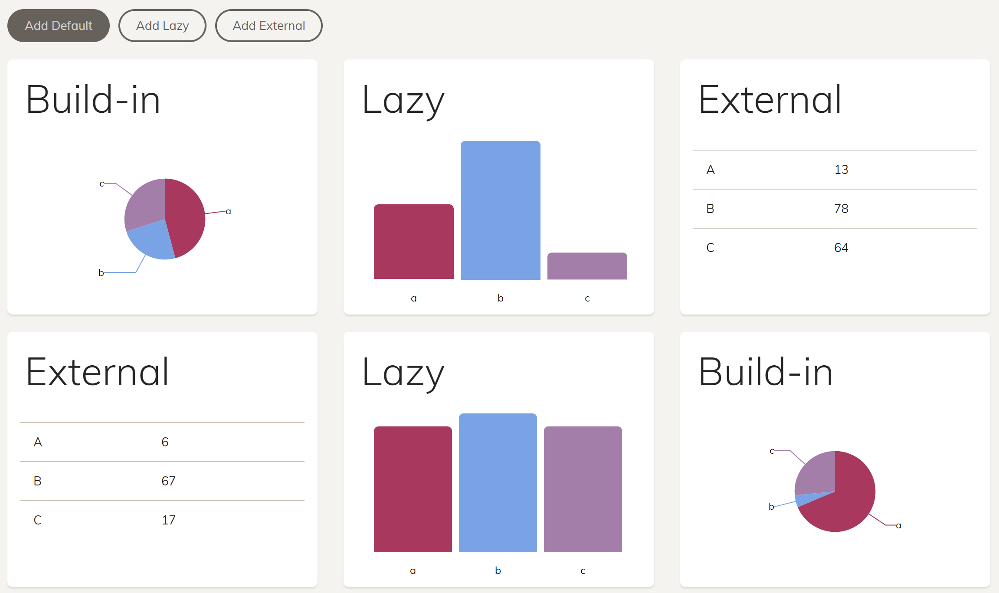

# Angular Elements Dashboard Demo

Shows how to dynamically load and create Angular Elements (Custom Elements, Web Components).



Features:
- Dynamically create app-internal Angular Elements
- Lazy load app-internal Angular Elements
- Load external Custom Elements

Remarks:
- The external Custom Element is built with [ngx-build-plus](https://www.npmjs.com/package/ngx-build-plus)
- The example uses the ``@webcomponents/custom-elements`` polyfill (see references in ``angular.json`` and ``polyfills.ts``)
- For lazy loading without the router, the lazy module is also mentioned in ``angular.json``.
- External Components will become much smaller when ngIvy arrives (planned for Angular 7)
- For sharing dependencies b/w components, lookup [ngx-build-plus](https://www.npmjs.com/package/ngx-build-plus)

## Start

Build the external Custom Elements project before starting the main project:

```
npm install
npm run build:ce
npm start
```

## Trainings and Consultancy

If you need help with implementing huge Angular applications, feel free to reach out to us. We offer [trainings, workshops, and consultancy for Angular](https://www.softwarearchitekt.at/angular-schulung/).

---

_German Translation: Falls Du Hilfe bei der Umsetzung gro0er Angular Anwendungen beötigst, kannst Du Dich gerne bei uns melden. Wir bieten [Schulungen, Workshops und Beratung zu Angular](https://www.softwarearchitekt.at/angular-schulung/)._
