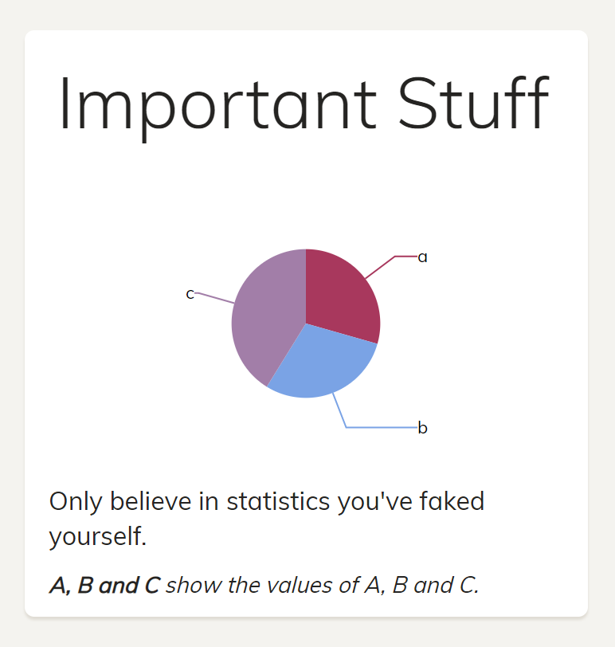

# Content Projection with Slots in Angular Elements (>=7)

Since Angular 7, we can use ``slots`` to project some markup into an component's template. These slots have been introduced with Shadow DOM v1 which Angular supports since version 6.1. 

This article shows how to use both, Shadow DOM v1 and slots. For this, it uses a component that shows a diagram:



The title, as well as the description and the legend on the bottom can be adjusted using slots. You can find the [source code in my GitHub repo](https://github.com/manfredsteyer/angular-elements-dashboard/tree/ng7) (branch: ng7):

» [Source Code (branch: ng7)](https://github.com/manfredsteyer/angular-elements-dashboard/tree/ng7)

## Shadow DOM v1

[Shadow DOM](https://developer.mozilla.org/en-US/docs/Web/Web_Components/Using_shadow_DOM) has always been an central concept for Angular Components. By default, Angular emulates this standard which isolates a component's style from other components. It's also possible to turn it off or to tell Angular to rely on the Browser's implementation which can provide a better isolation than the emulated one.

However, until Angular 6.1, Angular just supported what's known as Shadow DOM v0. Meanwhile, browser vendors agreed on the revised Version 1 which will be widely implemented. At the time of writing, Chrome, Safari, Firefox and Opera supported it and the Edge-team is currently implementing it.

To use Shadow DOM v1 in Angular (>= 6.1), just set the ``encapsulation`` property in the ``Component`` decorator to the newly introduced value ``ShadowDom``:

```typescript
@Component({
  selector: 'app-dashboard-tile',
  templateUrl: './dashboard-tile.component.html',
  encapsulation: ViewEncapsulation.ShadowDom
})
export class DashboardTileComponent implements OnInit {
  @Input() a: number;
  @Input() b: number;
  @Input() c: number;
  […]
} 
```

Don't confuse ``ViewEncapsulation.ShadowDom`` with ``ViewEncapsulation.Native`` which exists since Angular's first days and activated Shadow DOM v0 in the browser.

## Slots for Content Projection

Many Web Components -- or to be more precise, many Custom Elements -- need to be adaptable with some markup passed as the element's content. This is also called content projected because the passed content is projected to different positions of the element's template.

For this, Shadow DOM v1 introduced the ``slot`` element. Each ``slot`` marks a position where content can be projected to:

```typescript
<div class="card">
  <div class="header">
    <h1 class="title"><slot name="title">Standardwert</slot></h1>
  </div>
  <div class="content">

    <div style="height:200px">
      <ngx-charts-pie-chart [labels]="true" [results]="data">
      </ngx-charts-pie-chart>
    </div>

    <p><slot>Standardwert</slot></p>
    <i><slot name="legend">Standardwert</slot></i>
    
  </div>
</div>
```

Between the opening and the closing ``slot`` tags, we can place some default markup that is shown if the caller does not pass any content for it. There can be one default slot as well as several named slots.

When calling such a Custom Element, we can use the ``slot`` attribute to point to one of the named slots within the component's template:

```html
<div class="col-sm-3">
  <dashboard-tile a="10" b="5" c="15">

    <span slot="title">Important Stuff</span>
    <span slot="legend">A, B and C show the values of A, B and C.</span>
    Only believe in statistics you've faked yourself.

  </dashboard-tile>
</div>
```

Everything you connect to a slot that way will be projected to it. The rest is put into the default slot.

## Accessing Projected Content

For accessing projected content, Angular provides hooks like ``ngAfterContentChecked`` or ``ngAfterContentInit`` as well as content queries. 
Unfortunately, they don't work with slots. But we can make use of the ``slotschange`` event instead:

```html
<i><slot (slotchange)="slotChange($event)" name="legend">No Legend available.</slot></i>
```

In the set up event handler, we can grab the projected elements. For this, I'm using my helper method ``queryFirstAssignedContnet``:


```typescript
@Component({
  [...],
  encapsulation: ViewEncapsulation.ShadowDom
})
export class DashboardTileComponent  {
  
  [...]

  slotChange($event) {
    const content = this.queryFirstAssignedContnet('legend');
    console.debug('slotChange', content.innerHTML);
  }
}
```

This helper method just uses the Components ElementRef to query the slot in question. Than, it calls the ``queryAssignedContent`` method to get the projected content:

```typescript
@Component({
  [...],
  encapsulation: ViewEncapsulation.ShadowDom
})
export class DashboardTileComponent  {
  
  constructor(private elm: ElementRef) {
  }

  queryAssignedContent(slotName: string) {
    const selector = `slot[name=${slotName}]`;
    const slot = this.elm.nativeElement.shadowRoot.querySelectorAll(selector);
    if (slot.length === 0) return null;
    return slot[0].assignedNodes();
  }

  queryFirstAssignedContnet(slotName: string) {
    const result = this.queryAssignedContent(slotName);
    if (result === null) return null;
    if (result.length === 0) return null;
    return result[0];
  }

  slotChange($event) {
    const content = this.queryFirstAssignedContnet('legend');
    console.debug('slotChange', content.innerHTML);
  }
}
```
